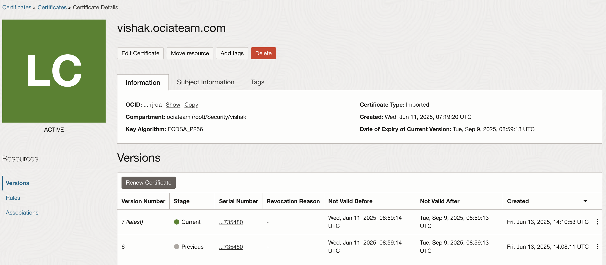

# oci-cert-uploader

A simple script to **import or update TLS/SSL certificates** into **Oracle Cloud Infrastructure (OCI) Certificate Management Service**.

This script works with certificates from any provider – whether it's Let’s Encrypt, Sectigo, DigiCert, or another CA.

---

## What This Script Does

- Reads a certificate (`chain.pem`),(`cert.pem`) and private key (`privkey.pem`) from your local file system.
- Checks if a certificate for the given domain already exists in OCI:
  - If it exists, updates the certificate.
  - If it does not exist, creates a new certificate entry.
- Can be run manually or scheduled via cron to keep your certificates in OCI in sync.

---

## Requirements

- [OCI CLI](https://docs.oracle.com/en-us/iaas/Content/API/SDKDocs/cliinstall.htm) installed and configured.
- A valid [OCI IAM policy](https://docs.oracle.com/en-us/iaas/Content/certificates/managing-certificates.htm#certs_required_iam_policy)
 that allows managing certificates in your chosen compartment.
- Certificate files on your system (for example, from Let’s Encrypt, Sectigo, or any other provider).

Make sure your certificate and key files are located in a similar structure (compatible with Let’s Encrypt):

```
/etc/letsencrypt/live/yourdomain.com/
├── chain.pem
├── cert.pem
└── privkey.pem
```

If not,adjust the certificate files accordingly or change the script to point to the files exisiting.

---

##  Usage

Run the script by passing your domain name as an argument. For example:

```bash
./oci-cert.sh yourdomain.com /etc/letsencrypt/live/yourdomain.com
```

The script will look for certificate files in:

```
/etc/letsencrypt/live/yourdomain.com/chain.pem
/etc/letsencrypt/live/yourdomain.com/cert.pem
/etc/letsencrypt/live/yourdomain.com/privkey.pem
```

If these files exist, it will check OCI Certificate Management Service for a certificate with the name `yourdomain.com-cert`:
- If found, it updates the certificate.
- If not found, it creates a new certificate entry.

---

##  Automating Every 30 Days

To automate the certificate upload/update with cron, open your crontab for editing:

```bash
crontab -e
```

Add a cron job like the following (this example runs the script every 30 days at 3:00 AM):

```cron
0 3 */30 * * /full/path/to/oci-cert.sh yourdomain.com /etc/letsencrypt/live/yourdomain.com >> /var/log/oci-cert-upload.log 2>&1
```

Adjust the path to your script and logging location as needed.

---


## Sample Output

Depending on whether the certificate exists, you might see:

```text
No existing cert found in OCI. Creating new cert: yourdomain.com-cert
Done!
```

or

```text
Existing cert found. Updating cert: yourdomain.com-cert
Done!
```



---

##  Use Cases

- Automatically uploading renewed certificates from Let’s Encrypt to OCI with Multiple domain support
- Importing manually obtained certificates (from Sectigo, DigiCert, etc.) into OCI.
- Keeping your OCI certificate inventory up to date with external certificate providers.

---

## Contributing

Contributions are welcome! Feel free to fork this project and enhance the script for:
- Additional logging or notification features
- Alternative file paths or custom configurations

---

## Author
VISHAK CHITTUVALAPIL
